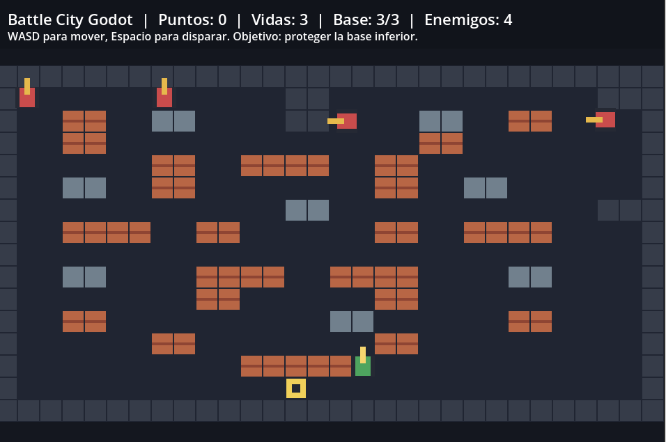
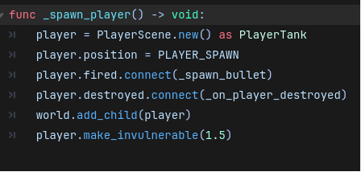
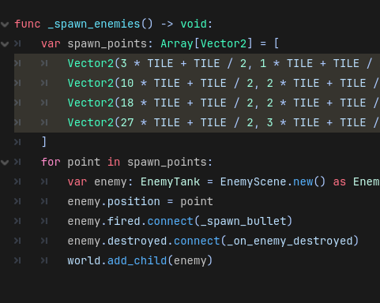

# Informe de avance del proyecto: Battle City Godot

**Materia:** Programacion Avanzada  
**Entrega:** Proyecto individual de videojuego  
**Alumno:** Joaquin Cortez  
**Fecha:** 17 de junio de 2026  

## 1. Presentacion del proyecto

El proyecto consiste en el desarrollo de un videojuego 2D inspirado en **Battle City**, adaptado como prototipo academico en el motor **Godot**. La propuesta toma como referencia la mecanica principal del juego clasico: el jugador controla un tanque, se desplaza por un mapa con obstaculos, dispara proyectiles, destruye bloques y debe defender una base ubicada en la parte inferior del escenario.

La implementacion actual funciona como un **MVP** para presentar el avance del trabajo en curso. El objetivo de esta etapa fue construir una version jugable minima, sin depender todavia de arte final ni de sistemas complejos, pero con las mecanicas principales ya visibles y probables dentro del motor.

## 2. Repositorio y recursos utilizados

**Repositorio del proyecto:**  
https://github.com/JoaquinCortezHub/battle_city_godot

**Video/playlist de referencia utilizada como guia:**  
https://youtube.com/playlist?list=PLDrGjPCkkytvFFQmlDMHM9l4z9hQZqYv2&si=vfU6485dwTX9hxUS

El proyecto fue desarrollado con **Godot 4** y scripts en **GDScript**. Se eligio este stack porque permite trabajar de forma directa con escenas 2D, nodos, fisicas simples, senales y entrada de teclado, que son elementos necesarios para construir un juego del estilo Battle City.

## 3. Estado actual del desarrollo

Actualmente el proyecto cuenta con una escena principal jugable. El jugador aparece en la parte inferior del mapa, cerca de la base que debe proteger. Los enemigos aparecen en la zona superior y se desplazan automaticamente por el escenario. Tanto el jugador como los enemigos pueden disparar proyectiles.

Se implementaron los siguientes elementos:

- Proyecto Godot inicializado y conectado al repositorio de GitHub.
- Escena principal `Main` configurada como escena de inicio.
- Tanque jugador controlado por teclado.
- Movimiento con teclas `W`, `A`, `S`, `D`.
- Disparo con la tecla `Espacio`.
- Tanques enemigos con movimiento automatico basico.
- Disparos enemigos y del jugador.
- Colisiones entre proyectiles, paredes, tanques, ladrillos y base.
- Bloques destructibles de ladrillo.
- Bloques metalicos no destructibles.
- Paredes externas del mapa.
- Base a defender con integridad `3/3`.
- Sistema de vidas del jugador.
- Reaparicion del jugador luego de ser destruido.
- Invulnerabilidad breve al reaparecer.
- HUD con puntaje, vidas, integridad de la base y cantidad de enemigos.

## 4. Controles implementados

Los controles actuales son:

- `W`: mover hacia arriba.
- `A`: mover hacia la izquierda.
- `S`: mover hacia abajo.
- `D`: mover hacia la derecha.
- `Espacio`: disparar.

La entrada de disparo fue reforzada para que funcione tanto con la accion `shoot` configurada en Godot como con la tecla `Space` detectada directamente desde codigo.

## 5. Estructura tecnica del prototipo

La logica se encuentra organizada en scripts separados:

- `scripts/main.gd`: construccion del mapa, generacion de jugador/enemigos, HUD, puntaje, vidas y estado general de la partida.
- `scripts/tank.gd`: comportamiento comun de tanques, movimiento, disparo, vida e invulnerabilidad.
- `scripts/player_tank.gd`: entrada de teclado y comportamiento especifico del jugador.
- `scripts/enemy_tank.gd`: IA simple de enemigos, seleccion de direccion y disparos automaticos.
- `scripts/bullet.gd`: movimiento de proyectiles y deteccion de impactos.
- `scenes/main.tscn`: escena principal del juego.
- `project.godot`: configuracion del proyecto, escena inicial, resolucion e input map.

## 6. Capturas del avance

### Captura 1 - Juego en ejecucion

La primera captura muestra el MVP corriendo dentro de Godot. Se observa el mapa 2D con paredes externas, ladrillos destructibles, bloques metalicos, enemigos en la parte superior, jugador en la zona inferior, base a proteger y HUD funcional.

### Captura 2 - Codigo de reaparicion del jugador

La segunda captura muestra parte del metodo `_spawn_player()`, donde se instancia el tanque del jugador, se lo ubica en el punto de aparicion, se conectan sus senales de disparo y destruccion, y se activa una invulnerabilidad breve luego de aparecer.

### Captura 3 - Codigo de aparicion de enemigos

La tercera captura muestra la funcion `_spawn_enemies()`, donde se definen los puntos iniciales de aparicion de los tanques enemigos. Estos puntos fueron ajustados para evitar que los enemigos aparezcan dentro de paredes u obstaculos.

## 7. Problemas encontrados y ajustes realizados

Durante la prueba del MVP se detectaron varios detalles que fueron corregidos:

- El disparo con `Espacio` no funcionaba correctamente porque la accion `shoot` tenia una tecla mal configurada en el archivo del proyecto.
- Un enemigo aparecia demasiado cerca de una pared y quedaba girando en su lugar sin poder desplazarse.
- Cuando el jugador era destruido, no reaparecia de forma clara y la partida podia terminar rapidamente.
- La base se destruia con un solo impacto, lo que hacia que la prueba del prototipo fuera demasiado corta.

Para estabilizar el MVP se hicieron estos ajustes:

- Se corrigio el mapeo de `Espacio`.
- Se agrego una deteccion directa de `KEY_SPACE` desde el codigo del jugador.
- Se movieron los puntos de aparicion de los enemigos a celdas libres del mapa.
- Se implemento reaparicion del jugador despues de morir.
- Se agrego invulnerabilidad temporal al reaparecer.
- Se agrego integridad de base `3/3`.
- Se actualizo el HUD para mostrar el estado de la base.

## 8. Trabajo pendiente

Para llegar a una version mas completa del videojuego, quedan pendientes las siguientes mejoras:

- Reemplazar las figuras simples por sprites definitivos.
- Agregar animaciones de explosion al destruir tanques o ladrillos.
- Incorporar efectos de sonido para disparos, impactos y destruccion.
- Mejorar la IA enemiga para que persiga al jugador o a la base.
- Implementar mas niveles o mapas.
- Agregar pantalla de inicio, pausa, victoria y derrota.
- Exportar el juego como ejecutable.
- Pulir balance de vidas, velocidad, cantidad de enemigos y dificultad.

## 9. Conclusion

El proyecto ya cuenta con una base funcional para demostrar el avance del videojuego. Aunque todavia se encuentra en etapa de prototipo, el MVP permite jugar una partida simple, mover el tanque, disparar, destruir bloques, recibir ataques enemigos, defender la base y visualizar el estado de la partida desde el HUD.

Este avance sirve como punto de partida para continuar el desarrollo hasta una version presentable en la mesa de examen, manteniendo el codigo versionado en GitHub y tomando como guia la playlist de referencia indicada.
